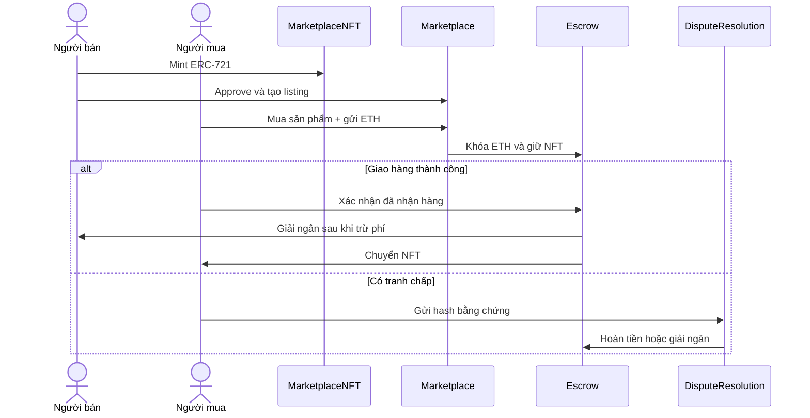

# TrustChain — NFT Marketplace với Smart-Contract Escrow

TrustChain là đồ án blockchain mô phỏng một chợ mua bán sản phẩm vật lý. Smart contract quản lý chứng nhận ERC-721, listing, thanh toán ký quỹ, tranh chấp và uy tín; ứng dụng web quản lý tài khoản, hồ sơ và dữ liệu sản phẩm ngoài chuỗi.

> **Trạng thái hiện tại:** bộ smart contract và ứng dụng web đều chạy được, nhưng web **chưa gọi trực tiếp smart contract**. Tạo mặt hàng trên web hiện chỉ lưu PostgreSQL. Luồng blockchain hoàn chỉnh được chứng minh riêng bằng test và mô phỏng Hardhat.

[](https://soliditylang.org/)
[](https://hardhat.org/)
[](https://nextjs.org/)
[](https://www.postgresql.org/)
[](LICENSE)

## Blockchain được dùng ở đâu?



Các quy tắc trên được thực thi trong EVM, không phụ thuộc vào giao diện:

- `MarketplaceNFT`: mint chứng nhận sản phẩm ERC-721 và ghi metadata URI.
- `Marketplace`: tạo/hủy listing, kiểm tra giá và chuyển giao dịch mua vào escrow.
- `Escrow`: giữ ETH và NFT, giải ngân, hoàn tiền, timeout và đóng băng khi tranh chấp.
- `FeeManager`: tính phí giao thức; cấu hình mô phỏng hiện dùng 250 bps (2,5%).
- `DisputeResolution`: ghi hash bằng chứng và chỉ cho địa chỉ có `ARBITRATOR_ROLE` ra phán quyết.
- `Reputation`: chỉ cập nhật uy tín từ giao dịch hoặc phán quyết đã được xác minh.

Mã nguồn nằm trong [`packages/contracts/contracts`](packages/contracts/contracts). Cấu hình Hardhat chính tại [`hardhat.config.js`](hardhat.config.js) chỉ build và test bộ contract này.

## Bằng chứng smart contract đang hoạt động

Chạy:

```powershell
npm.cmd install
npm.cmd run compile
npm.cmd test
npm.cmd run simulate:trustchain
```

Kết quả đã xác minh tại local:

- **23 test passing** cho mint NFT, listing, escrow, hoàn tiền, timeout, tranh chấp và reputation.
- Mô phỏng triển khai 6 contract trên blockchain Hardhat tạm thời.
- Alice mint NFT và đăng bán với giá `1.5 ETH`.
- Bob mua; `1.5 ETH` và NFT được khóa trong `Escrow`.
- Khi Bob xác nhận giao hàng, Alice nhận `1.4625 ETH`, treasury nhận `0.0375 ETH`, NFT chuyển cho Bob.
- Reputation của người mua và người bán được cập nhật từ giao dịch đã hoàn tất.

Mỗi lần chạy `simulate:trustchain`, Hardhat tạo một blockchain in-memory mới. Địa chỉ contract và trạng thái sẽ được đặt lại sau khi tiến trình kết thúc; đây là môi trường minh họa, chưa phải testnet công khai.

## Dữ liệu on-chain và off-chain

| Dữ liệu | Nơi lưu hiện tại | Lý do |
|---|---|---|
| Chủ sở hữu NFT, listing, giá bán | Smart contract | Cần kiểm chứng và không được sửa tùy ý |
| ETH đang ký quỹ, trạng thái giải ngân | Smart contract | Các bên không cần tin máy chủ web giữ tiền |
| Hash bằng chứng tranh chấp | Smart contract | Chứng minh bằng chứng tồn tại tại một thời điểm |
| Uy tín từ giao dịch hoàn tất | Smart contract | Hạn chế tự tạo đánh giá giả |
| Email, mật khẩu hash, số điện thoại | PostgreSQL | Không đưa dữ liệu cá nhân lên blockchain công khai |
| Hồ sơ, địa chỉ, mô tả và bộ lọc sản phẩm | PostgreSQL | Dễ cập nhật và tìm kiếm, không tốn gas |
| Ảnh và metadata NFT | Chưa tích hợp IPFS thật | URI trong mô phỏng hiện là dữ liệu minh họa |

Blockchain không tự chứng minh món hàng vật lý là hàng thật. Nó chứng minh lịch sử của chứng nhận số, quyền sở hữu và việc thanh toán tuân theo smart contract. Độ tin cậy ban đầu vẫn phụ thuộc bên phát hành chứng nhận và quy trình xác minh sản phẩm.

## Chạy ứng dụng web

Yêu cầu:

- Node.js 20.6 trở lên.
- Docker Desktop đang chạy.

Từ thư mục gốc:

```powershell
npm.cmd run dev:marketplace
```

Lệnh này:

1. Khởi động PostgreSQL và Mailpit bằng Docker.
2. Tạo/cập nhật cấu hình local và Prisma Client.
3. Đồng bộ schema của web.
4. Chạy Next.js tại http://localhost:3000.

Các địa chỉ local:

- Web: http://localhost:3000/vi
- Mailpit: http://localhost:8025
- PostgreSQL: `localhost:5432`

Hướng dẫn chi tiết:

- [Chạy marketplace local](docs/MARKETPLACE_LOCAL.md)
- [Đăng ký, xác thực email và OAuth](docs/AUTH_SETUP.md)

## Những gì web đã làm được

- Đăng ký và đăng nhập bằng email hoặc số điện thoại.
- Xác thực email và đặt lại mật khẩu qua Mailpit.
- Cấu hình tùy chọn cho Google và Facebook OAuth.
- Hồ sơ/shop công khai, avatar và chỉnh sửa hồ sơ.
- Tạo, xem và lọc mặt hàng lưu trong PostgreSQL.
- Giao diện tiếng Việt/tiếng Anh và responsive.
- Giới hạn quyền truy cập hồ sơ, sản phẩm và trang quản trị.

## Giới hạn hiện tại

Những phần sau chưa phải dữ liệu blockchain thật trên giao diện:

- Form đăng mặt hàng chưa mint `MarketplaceNFT` và chưa gọi `createListing`.
- Trang NFT đang dùng danh sách mẫu.
- Trang đơn hàng và tiến trình escrow đang dùng object mẫu.
- Trang phân xử đang dùng danh sách tranh chấp mẫu.
- Web chưa kết nối ví, chưa kiểm tra network và chưa hiển thị transaction hash.
- IPFS chưa được tích hợp; mô phỏng chỉ sử dụng URI minh họa.
- Dữ liệu nhạy cảm nằm ngoài chuỗi nhưng chưa có lớp mã hóa ứng dụng riêng cho địa chỉ giao hàng.
- Script `packages/contracts/scripts/deploy.js` còn mã trùng và chưa nằm trong quy trình đã xác minh; dùng `simulate:trustchain` để demo local ở thời điểm hiện tại.

Vì vậy, UI không nên tuyên bố một mặt hàng “đã được NFT xác minh” hoặc “được escrow bảo vệ” nếu bản ghi chưa có `chainId`, địa chỉ contract, `tokenId` và transaction hash tương ứng.

## Lộ trình tích hợp blockchain với web

1. Kết nối MetaMask bằng wagmi/viem và yêu cầu đúng `chainId`.
2. Sửa pipeline deploy, xuất ABI và địa chỉ contract cho web.
3. Khi đăng sản phẩm: upload metadata, mint NFT, approve và tạo listing.
4. Lưu `chainId`, `contractAddress`, `tokenId`, `listingId` và `txHash` vào PostgreSQL để lập chỉ mục.
5. Khi mua: gọi `buyItem`, đọc receipt và đồng bộ event `ItemPurchased`/`EscrowDeposited`.
6. Thay trang đơn hàng mẫu bằng dữ liệu `Escrow.getEscrow()`.
7. Thay trang tranh chấp mẫu bằng `DisputeResolution` và hash bằng chứng.
8. Hiển thị trạng thái pending/confirmed/reverted cùng liên kết block explorer.
9. Triển khai lên testnet để giao dịch và contract tồn tại độc lập với máy phát triển.

## Kiểm tra web

Khi PostgreSQL, Mailpit và web đang chạy:

```powershell
npm.cmd run typecheck --prefix apps/web
npm.cmd run test:auth --prefix apps/web
npm.cmd run test:ui --prefix apps/web
```

## Cấu trúc repository

```text
BlockChain/
├── apps/web/                      # Next.js, NextAuth, Prisma và giao diện marketplace
├── packages/contracts/
│   ├── contracts/                # Bộ smart contract TrustChain đang được Hardhat build
│   ├── test/                     # 23 kiểm thử smart contract
│   └── scripts/                  # Deploy và mô phỏng marketplace
├── prisma/schema.prisma          # Schema backend mở rộng, chưa phải schema runtime của web
├── apps/web/prisma/schema.prisma # Schema PostgreSQL mà web đang sử dụng
├── contracts/                    # Prototype nghiên cứu AegisMed, không thuộc Hardhat build chính
├── docs/                         # Hướng dẫn local, auth và tài liệu AegisMed cũ
├── docker-compose.yml            # PostgreSQL + Mailpit
├── hardhat.config.js             # Cấu hình TrustChain contracts/tests
└── package.json                  # Script cấp repository
```

## Ghi chú về AegisMed

Thư mục [`contracts`](contracts) cùng [`docs/ARCHITECTURE.md`](docs/ARCHITECTURE.md) và [`docs/WHITE_PAPER.md`](docs/WHITE_PAPER.md) là prototype nghiên cứu trước đây về truy xuất dược phẩm, Merkle proof và cold-chain oracle. Prototype này được giữ lại để tham khảo nhưng **không được biên dịch hoặc kiểm thử bởi cấu hình Hardhat chính hiện tại**.

Nếu tiếp tục AegisMed, cần tách thành workspace/cấu hình Hardhat riêng và không trộn tuyên bố của AegisMed với sản phẩm TrustChain.

## Mục tiêu học thuật

TrustChain dùng blockchain tại những nơi cần giảm sự phụ thuộc vào máy chủ trung tâm:

- Quyền sở hữu chứng nhận số.
- Quy tắc listing và mua bán.
- Ký quỹ tài sản.
- Phán quyết tranh chấp có kiểm soát quyền.
- Uy tín chỉ hình thành từ giao dịch đã xác minh.

PostgreSQL vẫn được dùng cho dữ liệu riêng tư và truy vấn ứng dụng. Thiết kế hybrid này tránh đưa thông tin cá nhân lên blockchain và tránh trả gas cho dữ liệu không cần đồng thuận công khai.

## License

MIT License.
