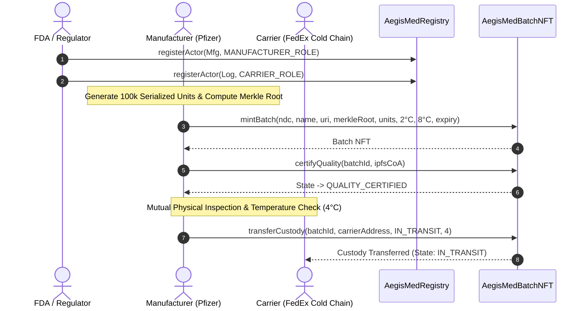
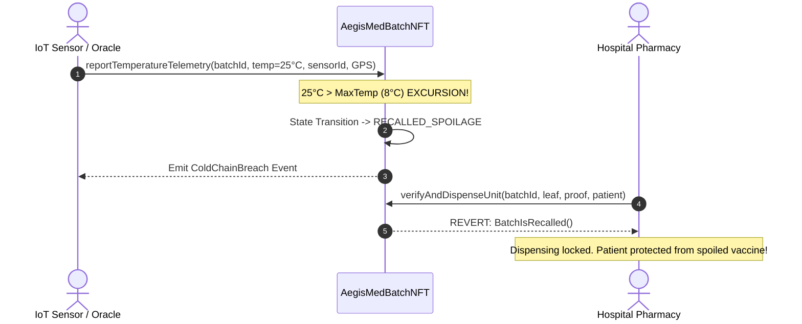
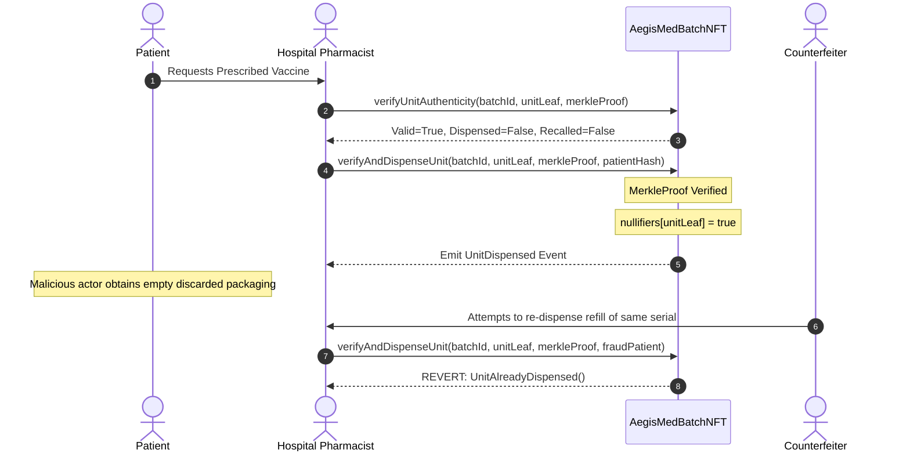

# AegisMed Technical Architecture & Design Document

## 1. System Topology

The AegisMed Protocol comprises three distinct operational layers:
1. **Accreditation & Identity Layer (`AegisMedRegistry.sol`)**:
   - Manages role assignments (`REGULATOR_ROLE`, `MANUFACTURER_ROLE`, `CARRIER_ROLE`, `DISTRIBUTOR_ROLE`, `PHARMACY_ROLE`, `ORACLE_ROLE`).
   - Stores legal entity metadata, FDA Establishment Identifiers (FEI), and DEA numbers.
   - Provides instant regulatory suspension mechanism.
2. **Batch Digital Product Passport Layer (`AegisMedBatchNFT.sol`)**:
   - Dynamic ERC-721 token representing physical pharmaceutical manufacturing batches.
   - Maintains on-chain Finite State Machine (FSM).
   - Stores 32-byte Merkle Root representing all serialized unit packages.
   - Maintains cryptographic nullifier mapping (`isUnitDispensed[unitHash]`).
   - Implements EIP-712 typed structured data verification for dual-signed custodial transfers.
3. **Autonomous Physical Telemetry Layer (`MockTemperatureOracle.sol`)**:
   - Simulates certified IoT sensors / Chainlink node gateways.
   - Periodically reports ambient temperature and GPS checkpoints.
   - Automatically quarantines batch upon temperature violation.

---

## 2. Interaction Sequence Diagrams

### 2.1 Batch Minting & Custody Handover Sequence


### 2.2 Cold-Chain Autonomous Excursion Quarantine


### 2.3 Point-of-Care Unit Dispensing & Anti-Replay Nullifier


---

## 3. Gas Consumption & Space Complexity Analysis

| Operation | Space Complexity (On-Chain) | Time Complexity | Estimated Gas (Solidity 0.8.24) |
| :--- | :--- | :--- | :--- |
| `mintBatch` (100,000 units) | $O(1)$ (32 bytes Merkle root) | $O(1)$ | $\sim 142,000$ gas |
| `certifyQuality` | $O(1)$ (IPFS string) | $O(1)$ | $\sim 35,000$ gas |
| `transferCustody` | $O(1)$ (address + state) | $O(1)$ | $\sim 48,000$ gas |
| `reportTemperatureTelemetry` | $O(1)$ (appends log) | $O(1)$ | $\sim 42,000$ gas |
| `verifyAndDispenseUnit` ($N=100,000$) | $O(1)$ (1 storage bit nullifier) | $O(\log_2 N) \approx 17$ hashes | $\sim 32,000$ gas |
| `transferCustodyWithHandshake` (EIP-712) | $O(1)$ | $O(1)$ (2 ecrecover) | $\sim 65,000$ gas |

---

## 4. Contract Inheritance Hierarchy

```text
OpenZeppelin ERC721URIStorage
      ▲
      │
      ├─────── OpenZeppelin EIP712
      │             ▲
      │             │
      ├─────── OpenZeppelin ReentrancyGuard
      │             ▲
      │             │
AegisMedBatchNFT ───┴── IAegisMedBatchNFT
```

