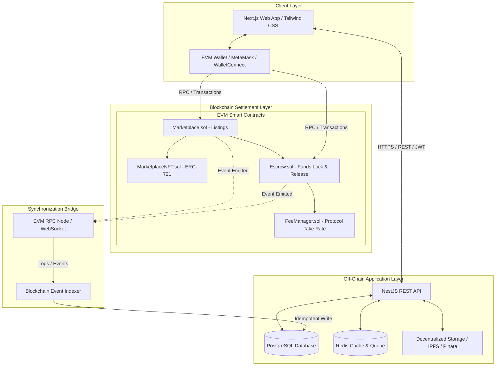
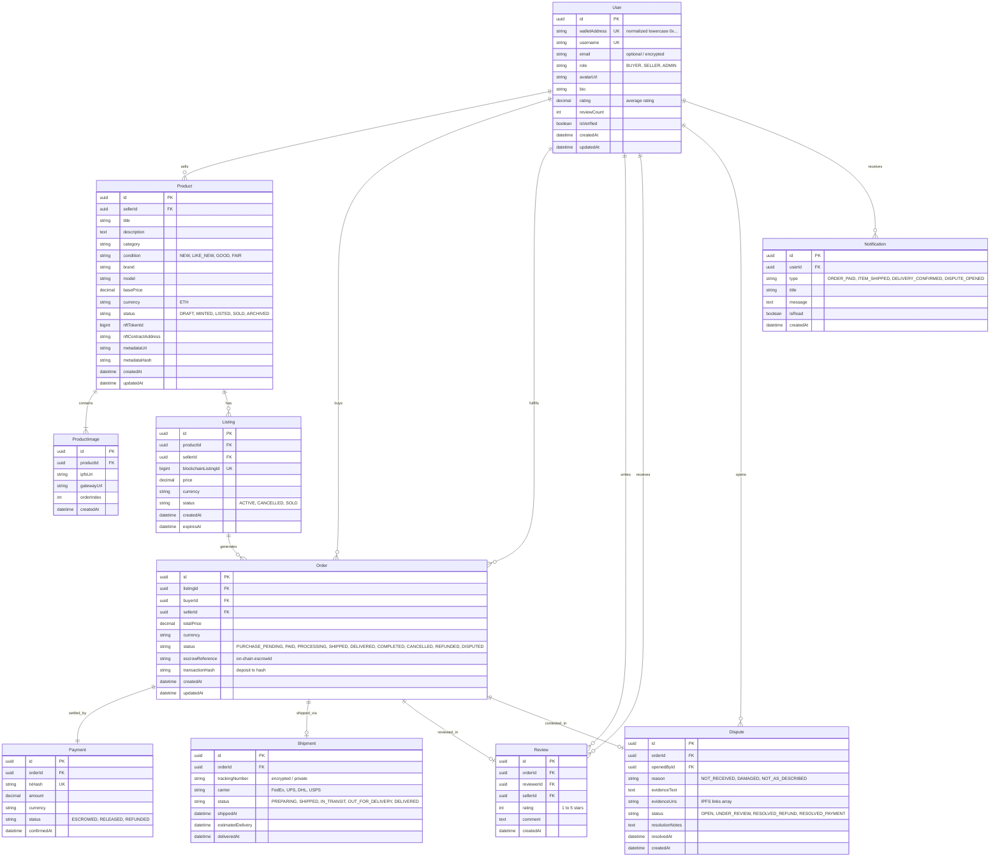
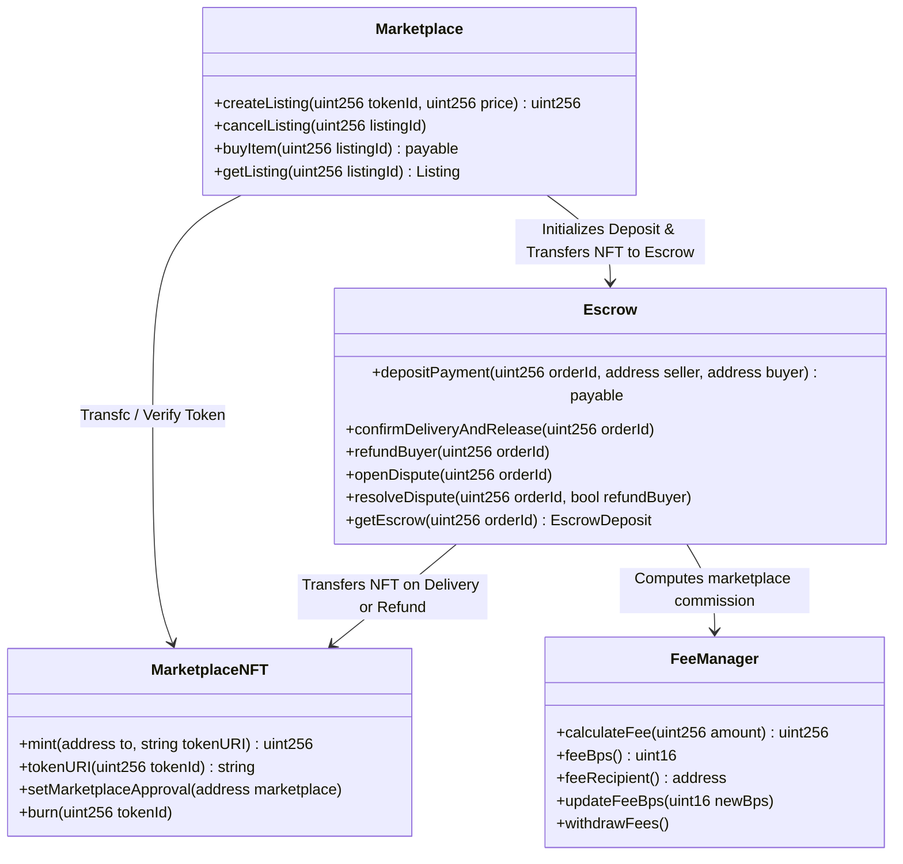
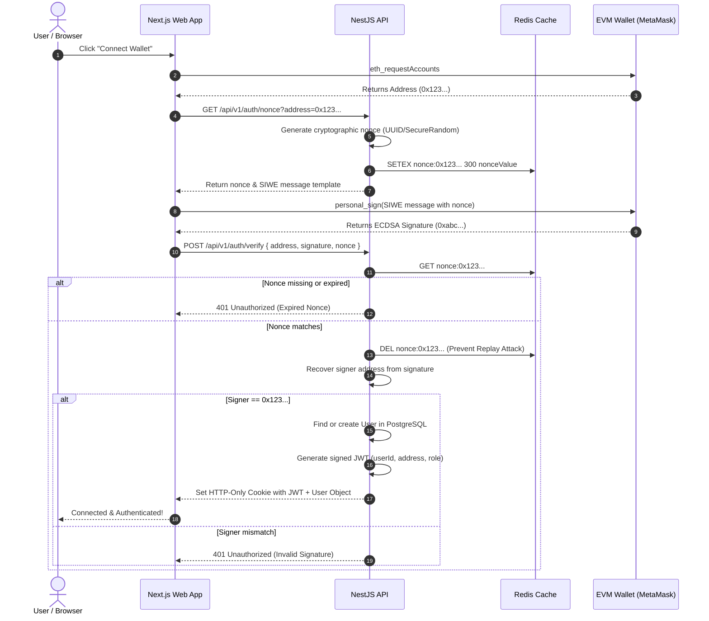
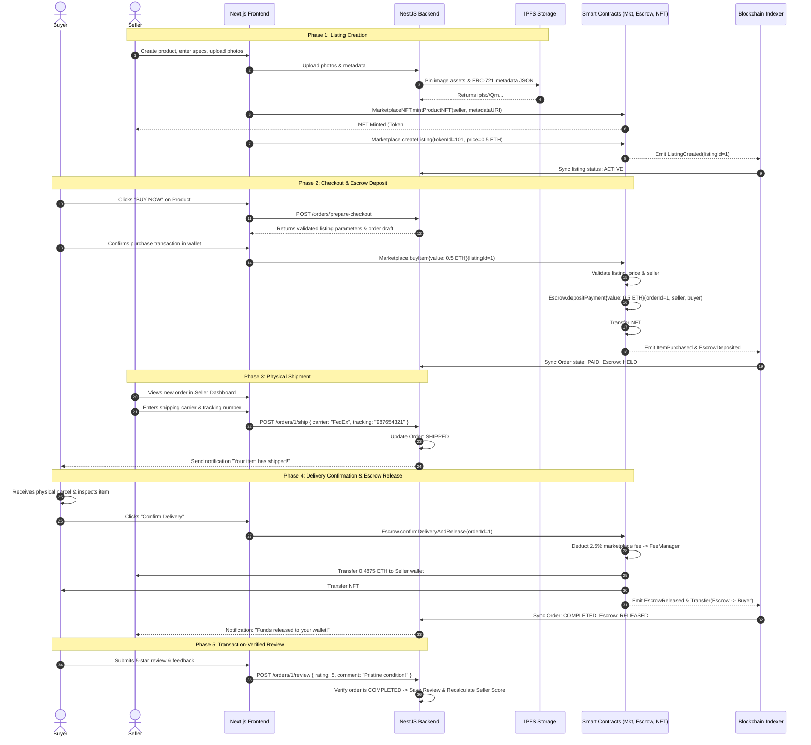
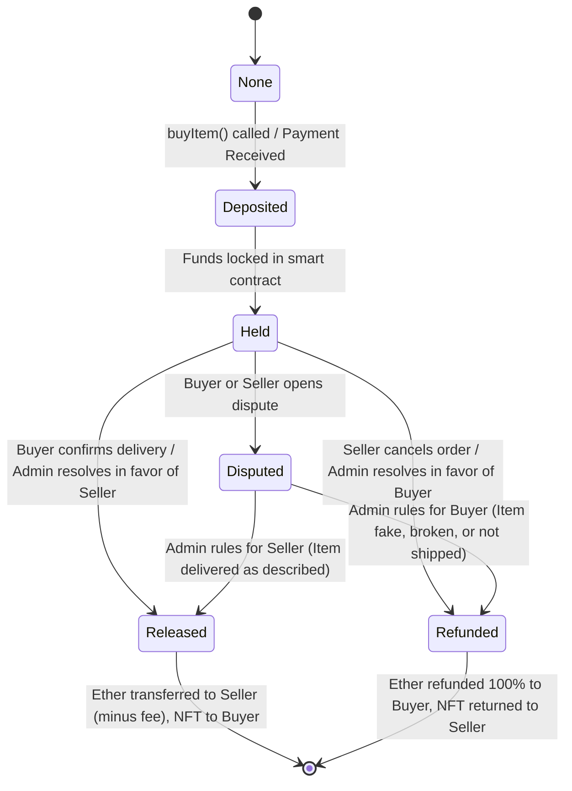
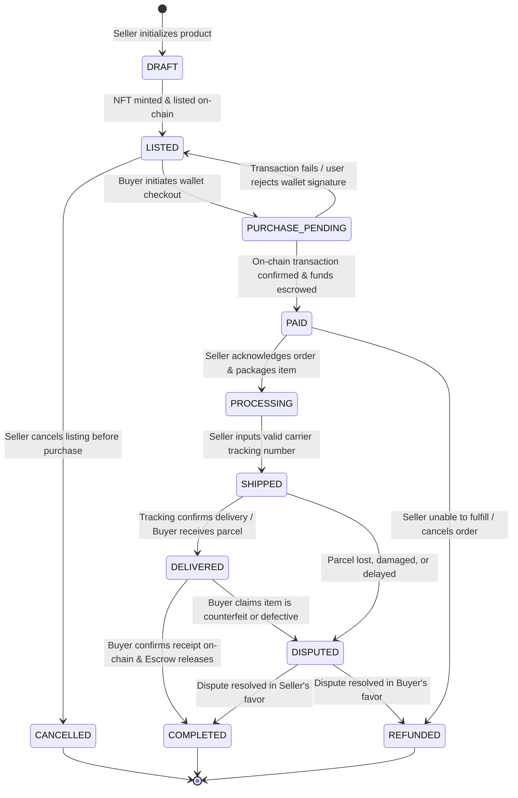
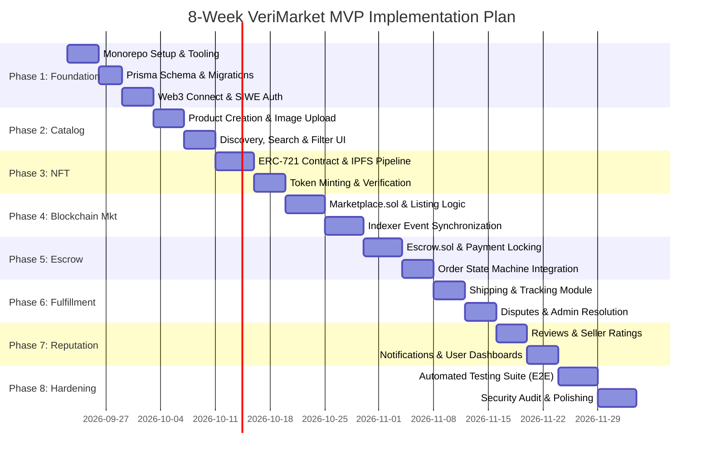

# Master Architecture & Technical Specification: VeriMarket (NFT-Backed P2P E-Commerce Marketplace)

**Document Version:** 1.0.0  
**Authors:** Lead Software Architect, Senior Full-Stack Engineer, Solidity/Web3 Engineer, Database Architect, Security Engineer  
**Target Delivery:** 8-Week Production-Grade MVP  

---

## Table of Contents
1. [A. Complete Architecture Overview](#a-complete-architecture-overview)
2. [B. Repository & Folder Structure](#b-repository--folder-structure)
3. [C. Technology Choices with Justification](#c-technology-choices-with-justification)
4. [D. Database ERD](#d-database-erd)
5. [E. Smart Contract Architecture](#e-smart-contract-architecture)
6. [F. Smart Contract Function List](#f-smart-contract-function-list)
7. [G. Smart Contract Event List](#g-smart-contract-event-list)
8. [H. API Endpoint List](#h-api-endpoint-list)
9. [I. Frontend Route & Page List](#i-frontend-route--page-list)
10. [J. Authentication Flow (SIWE)](#j-authentication-flow-siwe)
11. [K. Purchase Sequence Diagram](#k-purchase-sequence-diagram)
12. [L. Escrow Lifecycle](#l-escrow-lifecycle)
13. [M. Order State Machine](#m-order-state-machine)
14. [N. Security Model & Threat Mitigation](#n-security-model--threat-mitigation)
15. [O. Concrete Development Roadmap](#o-concrete-development-roadmap)
16. [P. MVP vs. Phase 2 Feature Separation](#p-mvp-vs-phase-2-feature-separation)

---

## A. Complete Architecture Overview

VeriMarket is a hybrid peer-to-peer e-commerce marketplace that merges traditional web platform UX with trust-minimized blockchain mechanics. The architecture strictly enforces the **Separation of Authoritative Truth**:



### Authoritative Boundaries
1. **Blockchain (On-Chain Truth)**:
   - Asset ownership (`ownerOf(tokenId)` on `MarketplaceNFT.sol`).
   - Active on-chain listing status and fixed financial terms (price, payment token, seller address).
   - Escrow balance custody and release/refund condition enforcement.
   - Non-sensitive metadata URI pointer (`ipfs://...`).
   - Financial dispute freezes and fee distribution.
2. **PostgreSQL (Off-Chain Truth)**:
   - Personal Identifiable Information (PII): Full names, delivery addresses, phone numbers, email addresses.
   - Product descriptions, categories, search indices, rich media links.
   - Physical carrier tracking identifiers (e.g. FedEx, UPS, DHL numbers) and logistics status.
   - Private communication, direct buyer-seller messaging, order notes.
   - User reputation, reviews, ratings, and platform operational analytics.
3. **IPFS (Decentralized Content-Addressed Storage)**:
   - Immutable product metadata schemas containing public verifiable attributes (Brand, Condition, Model, Product Hash).
   - Public product showcase images.
4. **Indexer (State Reconciliation)**:
   - Listens to EVM logs and updates PostgreSQL state idempotently. Ensures the web UI displays fresh on-chain confirmation statuses without polling blockchain RPCs continuously.

---

## B. Repository & Folder Structure

We organize the project as a clean, production-ready monorepo:

```text
marketplace/
├── apps/
│   ├── web/                         # Next.js 14+ (App Router, Tailwind CSS, wagmi/viem)
│   │   ├── app/                     # App router pages & layouts
│   │   │   ├── (auth)/              # Wallet connect & session verification
│   │   │   ├── (marketplace)/       # Explore, Category, Product pages
│   │   │   ├── (dashboard)/         # Buyer & Seller order management
│   │   │   ├── checkout/[id]/       # Escrow purchase flow
│   │   │   └── admin/               # Administrative moderation & dispute console
│   │   ├── components/              # Modular UI components (ProductCard, EscrowTimeline, etc.)
│   │   ├── hooks/                   # Custom Web3 & query hooks (useEscrow, useProduct, etc.)
│   │   └── lib/                     # API client, wagmi config, utilities
│   │
│   ├── api/                         # NestJS Enterprise REST API
│   │   ├── src/
│   │   │   ├── auth/                # SIWE nonce generation, signature validation, JWT
│   │   │   ├── users/               # User profiles, seller stats, public addresses
│   │   │   ├── products/            # Product catalog, metadata builder, IPFS upload
│   │   │   ├── listings/            # Marketplace listing orchestration
│   │   │   ├── orders/              # Order state machine, lifecycle tracking
│   │   │   ├── shipments/           # Off-chain carrier tracking & updates
│   │   │   ├── reviews/             # Transaction-verified review system
│   │   │   ├── disputes/            # Dispute filing, evidence submission, resolution
│   │   │   ├── notifications/       # In-app event notification dispatcher
│   │   │   ├── ipfs/                # IPFS pinning service integration
│   │   │   └── common/              # Guards, interceptors, Prisma service, filters
│   │   └── test/                    # NestJS unit and e2e tests
│   │
│   └── indexer/                     # Real-time Blockchain Event Indexer
│       ├── src/
│       │   ├── listeners/           # WebSocket listeners for Marketplace & Escrow
│       │   ├── handlers/            # Idempotent handlers for smart contract events
│       │   └── poller/              # Catch-up reconciliation worker for missed blocks
│       └── test/                    # Event handling integration tests
│
├── packages/
│   ├── contracts/                   # Smart Contract Development (Hardhat / Solidity 0.8.28)
│   │   ├── contracts/
│   │   │   ├── MarketplaceNFT.sol   # ERC-721 tokenized product certificates
│   │   │   ├── Marketplace.sol      # Non-custodial listing and purchase coordinator
│   │   │   ├── Escrow.sol           # Secure payment locking, release, and refund
│   │   │   ├── FeeManager.sol       # Configurable protocol fee collector
│   │   │   └── interfaces/          # Clean contract interfaces
│   │   ├── test/                    # Comprehensive Hardhat/Chai test suite
│   │   └── scripts/                 # Deployment, verification, and mock seeding
│   │
│   ├── types/                       # Shared TypeScript interfaces & DTOs
│   │   └── src/                     # OrderStatus, ListingDTO, EscrowState, etc.
│   │
│   └── config/                      # Shared ESLint, Prettier, and TypeScript configs
│
├── prisma/                          # Central Prisma Schema & Migrations
│   ├── schema.prisma                # Normalized database schema
│   └── migrations/                  # Versioned SQL migrations
│
├── docs/                            # Formal architecture, white paper, and sequence diagrams
├── package.json                     # Monorepo workspaces configuration
└── README.md                        # Quick-start instructions and presentation guide
```

---

## C. Technology Choices with Justification

| Layer / Tool | Selected Technology | Architectural Justification |
| :--- | :--- | :--- |
| **Frontend Framework** | Next.js 14+ (App Router) | High-performance React framework with Server-Side Rendering (SSR) for SEO-friendly product discovery, optimized image components, and route grouping. |
| **Styling** | Tailwind CSS | Utility-first styling enabling a clean, responsive, modern e-commerce visual identity without crypto-clutter. |
| **Web3 Client** | wagmi + viem | Lightweight, fully type-safe Ethereum library replacing legacy web3.js/ethers v5. Native React hooks, smaller bundle size, and robust multi-wallet connector support. |
| **Backend Framework** | NestJS (Node.js) | Structured, enterprise-grade architecture with modular dependency injection, declarative validation pipes (`class-validator`), guards, and clean separation of concerns. |
| **Database & ORM** | PostgreSQL + Prisma ORM | Relational ACID guarantees required for multi-step order states, foreign key integrity, and index optimization. Prisma provides compile-time type safety across API services. |
| **Smart Contract Engine** | Solidity 0.8.28 + OpenZeppelin v5 | Industry standard for secure EVM programming. OpenZeppelin provides audited primitives (`ReentrancyGuard`, `ERC721URIStorage`, `Ownable2Step`, `Pausable`). |
| **Decentralized Storage** | IPFS (Pinata / Mock IPFS) | Content-addressed storage ensures that once an NFT's metadata is minted, the underlying product attributes cannot be surreptitiously edited by any party. |
| **Cache & Task Queue** | Redis | Ephemeral nonce tracking for wallet login, rate limiting, and BullMQ queues for asynchronous event processing. |
| **Authentication** | SIWE (Sign-In with Ethereum, EIP-4361) | Cryptographically binds a user's wallet address to an application session via one-time challenge nonces and ECDSA signatures, issuing stateless JWTs. |

---

## D. Database ERD

The database schema is fully normalized and maps the operational marketplace state:



---

## E. Smart Contract Architecture

The on-chain system avoids monolithic coupling by distributing responsibility across four distinct, interacting smart contracts:



### Contract Responsibilities
1. **`MarketplaceNFT.sol`**:
   - Standard ERC-721 token with `ERC721URIStorage`.
   - Each token represents a unique physical item verified by the marketplace.
   - Non-sensitive metadata URI stored immutably.
   - Authorized minting (only the creator or verified seller).
2. **`Marketplace.sol`**:
   - Manages listing creation, price validation, and listing cancellation.
   - Handles the `buyItem` transaction: verifies the listing is active, validates correct Ether value, locks the NFT into the `Escrow` contract, and calls `Escrow.depositPayment`.
3. **`Escrow.sol`**:
   - Holds the buyer's funds securely until delivery is confirmed.
   - On delivery confirmation by buyer (or admin dispute resolution): releases `amount - fee` to seller, releases `fee` to `FeeManager`, and transfers the NFT from escrow to the buyer.
   - On seller cancellation or buyer refund: returns 100% of funds to the buyer and returns the NFT to the seller.
4. **`FeeManager.sol`**:
   - Controls protocol fee percentage (e.g. 250 basis points = 2.5%).
   - Safeguards protocol revenue with multi-sig/ownable withdrawal.

---

## F. Smart Contract Function List

### 1. `MarketplaceNFT.sol`
- `mintProductNFT(address to, string calldata metadataURI) external returns (uint256)`: Mints a new token with its IPFS metadata URI.
- `setApprovalForMarketplace(address marketplaceAddress, bool approved) external`: Whitelists the marketplace contract to manage escrow custody.
- `tokenURI(uint256 tokenId) external view returns (string memory)`: Returns the IPFS metadata link.

### 2. `Marketplace.sol`
- `createListing(uint256 tokenId, uint256 price) external returns (uint256 listingId)`: Validates ownership, checks approvals, and registers the listing.
- `cancelListing(uint256 listingId) external`: Allows the seller to delist an unsold item.
- `buyItem(uint256 listingId) external payable returns (uint256 orderId)`: Accepts buyer payment, validates amount, initiates escrow deposit, transfers NFT to escrow custody, and emits `ItemPurchased`.
- `getListing(uint256 listingId) external view returns (Listing memory)`: Returns listing state.

### 3. `Escrow.sol`
- `depositPayment(uint256 orderId, uint256 listingId, uint256 tokenId, address payable seller, address buyer) external payable`: Called exclusively by `Marketplace.sol` to hold Ether in escrow.
- `confirmDeliveryAndRelease(uint256 orderId) external`: Callable by the buyer or marketplace operator once delivery is confirmed. Deducts protocol fee, pays seller, and transfers NFT to buyer.
- `refundBuyer(uint256 orderId) external`: Callable by the seller (mutual cancellation) or admin resolution. Returns Ether to buyer and returns NFT to seller.
- `openDispute(uint256 orderId) external`: Callable by buyer or seller if an issue arises. Freezes funds in escrow until resolved.
- `resolveDispute(uint256 orderId, bool refundBuyer) external`: Restricted to `ADMIN_ROLE`. Settles the dispute and releases assets accordingly.
- `getEscrow(uint256 orderId) external view returns (EscrowRecord memory)`: Returns current escrow state.

### 4. `FeeManager.sol`
- `calculateFee(uint256 grossAmount) external view returns (uint256 feeAmount, uint256 netAmount)`: Computes basis points.
- `setFeeBps(uint16 newFeeBps) external onlyOwner`: Updates fee (capped at 10% maximum).
- `setFeeRecipient(address payable newRecipient) external onlyOwner`: Changes treasury wallet.
- `withdrawAccumulatedFees() external onlyOwner`: Pull-pattern fee withdrawal.

---

## G. Smart Contract Event List

The Indexer consumes these deterministic events:

```solidity
// MarketplaceNFT.sol
event ProductNFTMinted(uint256 indexed tokenId, address indexed creator, string metadataURI);

// Marketplace.sol
event ListingCreated(uint256 indexed listingId, uint256 indexed tokenId, address indexed seller, uint256 price);
event ListingCancelled(uint256 indexed listingId, address indexed seller);
event ItemPurchased(uint256 indexed listingId, uint256 indexed orderId, uint256 indexed tokenId, address buyer, address seller, uint256 price);

// Escrow.sol
event EscrowDeposited(uint256 indexed orderId, uint256 indexed listingId, address indexed buyer, address seller, uint256 amount);
event EscrowReleased(uint256 indexed orderId, address indexed seller, uint256 sellerAmount, uint256 feeAmount);
event EscrowRefunded(uint256 indexed orderId, address indexed buyer, uint256 refundAmount);
event EscrowDisputeOpened(uint256 indexed orderId, address indexed openedBy);
event EscrowDisputeResolved(uint256 indexed orderId, bool refundedToBuyer, address indexed resolver);

// FeeManager.sol
event FeeBpsUpdated(uint16 oldFeeBps, uint16 newFeeBps);
event FeesWithdrawn(address indexed recipient, uint256 amount);
```

---

## H. API Endpoint List

### 1. Authentication Module (`/api/v1/auth`)
- `GET /api/v1/auth/nonce?address=0x...`: Generates a cryptographic one-time nonce with an expiry TTL (5 minutes) stored in Redis.
- `POST /api/v1/auth/verify`: Accepts `{ address, signature, nonce }`. Performs ECDSA recovery (`ethers.verifyMessage`). Upon success, creates/finds the user in PostgreSQL and issues an HTTP-only JWT.
- `POST /api/v1/auth/logout`: Invalidates the session token.

### 2. User & Profile Module (`/api/v1/users`)
- `GET /api/v1/users/me`: Current authenticated user profile with private information.
- `PATCH /api/v1/users/me`: Update profile (username, bio, avatar).
- `GET /api/v1/users/:address`: Public profile showing verified sales count, rating, and public listings.

### 3. Product & IPFS Module (`/api/v1/products`)
- `POST /api/v1/products`: Seller drafts a product. Validates category, condition, and price.
- `POST /api/v1/products/:id/upload-media`: Uploads product images to IPFS via Pinata; stores returned IPFS CIDs in `ProductImage`.
- `POST /api/v1/products/:id/prepare-metadata`: Assembles standard ERC-721 JSON metadata and pins it to IPFS, returning `metadataUri`.
- `GET /api/v1/products`: Public search and discovery endpoint. Supports query filters (`search`, `category`, `condition`, `minPrice`, `maxPrice`, `sellerRating`, `sort`, `page`, `limit`).
- `GET /api/v1/products/:id`: Full product detail with seller profile and on-chain verification links.

### 4. Listing Module (`/api/v1/listings`)
- `POST /api/v1/listings/sync`: Indexer or frontend notifies backend of on-chain `ListingCreated` transaction hash.
- `GET /api/v1/listings/:id`: Retrieves listing details and blockchain status.

### 5. Order & Escrow Module (`/api/v1/orders`)
- `POST /api/v1/orders/prepare-checkout`: Validates listing state off-chain, validates buyer eligibility, and generates transaction parameters for `buyItem()`.
- `POST /api/v1/orders/confirm-payment`: Receives `ItemPurchased` tx hash, updates order status to `PAID`.
- `GET /api/v1/orders/buyer`: Retrieves buyer dashboard orders with status filters.
- `GET /api/v1/orders/seller`: Retrieves seller incoming orders and fulfillment tasks.
- `GET /api/v1/orders/:id`: Full order view with tracking, escrow status, and action buttons.

### 6. Shipping & Fulfillment Module (`/api/v1/shipments`)
- `POST /api/v1/orders/:id/ship`: Seller provides carrier name and tracking number. Transitions order to `SHIPPED`.
- `PATCH /api/v1/orders/:id/tracking`: Update carrier logistics milestone.
- `POST /api/v1/orders/:id/confirm-delivery`: Buyer confirms receipt. Signals escrow release.

### 7. Review & Reputation Module (`/api/v1/reviews`)
- `POST /api/v1/orders/:id/review`: Validates that the order is `COMPLETED`, reviewer is the buyer, and a review does not already exist. Updates seller's aggregate score.
- `GET /api/v1/users/:address/reviews`: Public reviews for a seller.

### 8. Dispute & Moderation Module (`/api/v1/disputes`)
- `POST /api/v1/orders/:id/dispute`: Buyer or seller opens a formal dispute with reason and evidence links.
- `GET /api/v1/admin/disputes`: Administrator queue of contested orders.
- `POST /api/v1/admin/disputes/:id/resolve`: Admin resolves dispute (calls `resolveDispute` on Escrow contract).

---

## I. Frontend Route & Page List

| Route | Purpose | Key Data Requirements | Web3 State Dependency |
| :--- | :--- | :--- | :--- |
| `/` | Marketplace Homepage | Featured products, categories, top sellers, platform stats. | None (Read-only) |
| `/explore` | Catalog & Search | Paginated product cards, price sliders, category facets. | None (Read-only) |
| `/category/[slug]` | Category Showcase | Products matching category with sorting options. | None (Read-only) |
| `/product/[id]` | Product Detail Page | Image gallery, price, condition, seller stats, NFT token ID, contract address, Etherscan link. | Wallet connect required for "Buy Now" |
| `/create-listing` | Seller Listing Studio | Form (title, description, price, condition), multi-image upload to IPFS, NFT mint button. | Connected wallet with `SELLER` role |
| `/checkout/[id]` | Direct Escrow Checkout | Order summary, shipping address entry, gas fee estimate, `buyItem` transaction submission modal. | Connected wallet on correct EVM network |
| `/orders` | Order Dashboard | Tabbed view (All, Processing, Shipped, Delivered, Completed). | Authenticated session |
| `/orders/[id]` | Order Tracking & Escrow Detail | Visual timeline (Paid $\to$ Shipped $\to$ Delivered $\to$ Completed), tracking updates, "Confirm Delivery" button. | Connected buyer/seller wallet |
| `/seller/[address]` | Public Seller Storefront | Seller avatar, rating, transaction completion rate, active listings, customer reviews. | None (Read-only) |
| `/nfts` | User Digital Certificate Vault | Displays user's purchased NFTs linked to physical items with metadata attributes. | Connected wallet |
| `/disputes/[id]` | Dispute Resolution View | Order breakdown, buyer complaint, seller response, admin resolution status. | Authenticated party/admin |
| `/admin` | Admin Moderation Portal | Platform metrics, dispute arbitrator console, user suspension tools. | Admin wallet signature |

---

## J. Authentication Flow (SIWE)



---

## K. Purchase Sequence Diagram

This end-to-end sequence illustrates the core value proposition of the platform:



---

## L. Escrow Lifecycle



---

## M. Order State Machine

Every order adheres to deterministic state transitions:



### Invalid Transition Guards
- Cannot cancel an order once status is `PAID` or `SHIPPED` (requires formal refund or dispute).
- Cannot complete an order if payment was not confirmed on-chain.
- Cannot submit a review unless order status is strictly `COMPLETED`.
- Escrow funds cannot be released or refunded more than once.

---

## N. Security Model & Threat Mitigation

### 1. Smart Contract Security Principles
- **Checks-Effects-Interactions (CEI)**: Every state update in `Marketplace.sol` and `Escrow.sol` occurs before external calls or Ether transfers.
- **Reentrancy Protection**: All payable and withdrawal methods inherit OpenZeppelin's `ReentrancyGuard` (`nonReentrant` modifier).
- **Pull over Push Payments**: Where practical, fees and balances are structured to prevent malicious fallback contracts from reverting transfers and causing a Denial of Service (DoS).
- **Strict Role Boundaries**: Only the `Marketplace` contract can deposit into `Escrow`. Only the `buyer` or `ADMIN_ROLE` can release escrow.
- **Emergency Circuit Breakers**: Inherits `Pausable` to freeze trading in the event of an identified vulnerability.

### 2. Off-Chain & Web Security Principles
- **No Private Keys Stored**: The backend never generates, stores, or handles private keys. All signing occurs client-side in the user's wallet.
- **Zero On-Chain PII**: Physical addresses, tracking codes, and names are encrypted at rest in PostgreSQL and never broadcast to public blockchain nodes or IPFS.
- **Nonce Replay Defense**: Nonces for wallet login are single-use with a 5-minute Redis TTL.
- **Rate Limiting & Input Validation**: All NestJS endpoints use `ValidationPipe` with whitelist enforcement to strip malicious properties. Rate limiting via `@nestjs/throttler` prevents API scraping and brute-force attacks.

---

## O. Concrete Development Roadmap



### Concrete Task Breakdown
- **Phase 1 (Foundation)**: Setup Turborepo/pnpm, NestJS API skeleton, Next.js Tailwind skeleton, PostgreSQL Docker setup, Prisma schema, Redis nonce cache, SIWE wallet authentication.
- **Phase 2 (Marketplace Catalog)**: Product models, image drag-and-drop, category browsing, full-text search, responsive product cards.
- **Phase 3 (NFT Protocol)**: `MarketplaceNFT.sol`, Pinata/IPFS metadata builder, client-side minting modal, blockchain explorer links.
- **Phase 4 (Marketplace Blockchain)**: `Marketplace.sol`, `ListingCreated` indexing, active listing synchronization.
- **Phase 5 (Escrow & Checkout)**: `Escrow.sol`, `FeeManager.sol`, `buyItem` transaction flow, automatic order state synchronization.
- **Phase 6 (Shipping & Disputes)**: Tracking entry, shipment milestones, buyer delivery confirmation, escrow release triggers, dispute modal.
- **Phase 7 (Reputation & Dashboards)**: Buyer/seller order tables, rating calculation, in-app notifications.
- **Phase 8 (Testing & Hardening)**: Full integration test suite (Solidity + Jest + Supertest), gas optimization, final documentation.

---

## P. MVP vs. Phase 2 Feature Separation

| Feature Area | In-Scope for Production MVP | Deferred to Phase 2 (Post-MVP) |
| :--- | :--- | :--- |
| **Purchasing Mode** | Direct "Buy Now" flow with single item checkout | Shopping cart with multi-item / multi-seller bundling |
| **Token Standard** | ERC-721 for unique physical collectibles / goods | ERC-1155 for high-volume identical items |
| **Payment Currency** | Native EVM Currency (ETH / MATIC / Sepolia ETH) | Multi-token ERC-20 payments (USDC, USDT) |
| **Sales Format** | Fixed price listings with cancellation support | English auctions, Dutch auctions, and counter-offers |
| **Arbitration** | Centralized Admin / Moderator dispute resolution | Decentralized Kleros / UMA oracle arbitration |
| **Messaging** | In-app notification alerts for order status | Real-time encrypted P2P WebSocket chat |
| **AI Enhancements** | Manual structured attributes & descriptions | AI automated listing classification & fraud risk score |
| **Multi-Chain** | Single EVM network deployment (Local / Sepolia) | Cross-chain messaging & bridging (Chainlink CCIP) |

